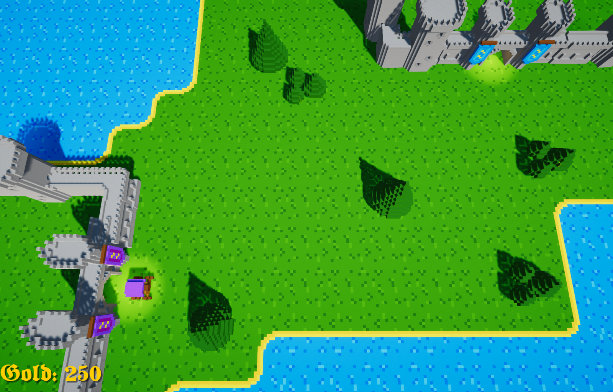
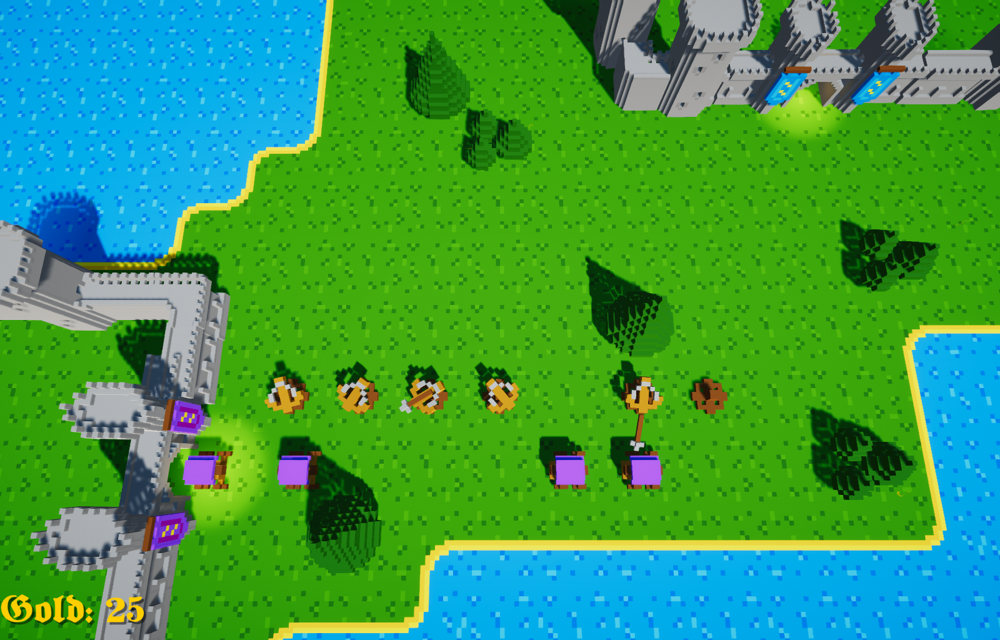

<!-- GAME PROJECT TITLE -->
# Realm-Rush---Game
Game created for study purposes by Matheus Soares Martins, and is was created to test a dynamical path finding algorithm that finds the shortest path,
while avoiding blocked tiles and towers. Also was created for understanding of the core functionality of a tower defense game. 
In this game you have to  placed towers to protect your castle(blue) to be invaded by the enemies(purple), the more enemies you defeat the more stronger
they get. 
Defeating enemies earn you money to build towers, and enemies steal money when they get into your castle.
 

This game was made to be played by one player, and it uses just the mouse to be played.
 

Player controls 
Mouse - Place towers on a tile if it is placeable 

Other controls 
C - Debug tools (show tiles, and path) 
Esc - Closes the game 
F11 - Toggle between fullscreen and windowed mode 
******************************************************************************

 

# Screenshots
<!-- GAME PROJECT IMAGES -->

# <!-- GAME PROJECT BUILDS -->
# Game download 
## Windows: https://mega.nz/folder/QZMzUbiB#cZ-6bulduKXJbbLQiMnN7w
## Mac: https://mega.nz/folder/YYsTwKxC#ASqI7bSZ7hxI69VschBoPg
## Linux: https://mega.nz/folder/REs3CJgZ#iir9lTKKsSGd3NHly3X2Ww
